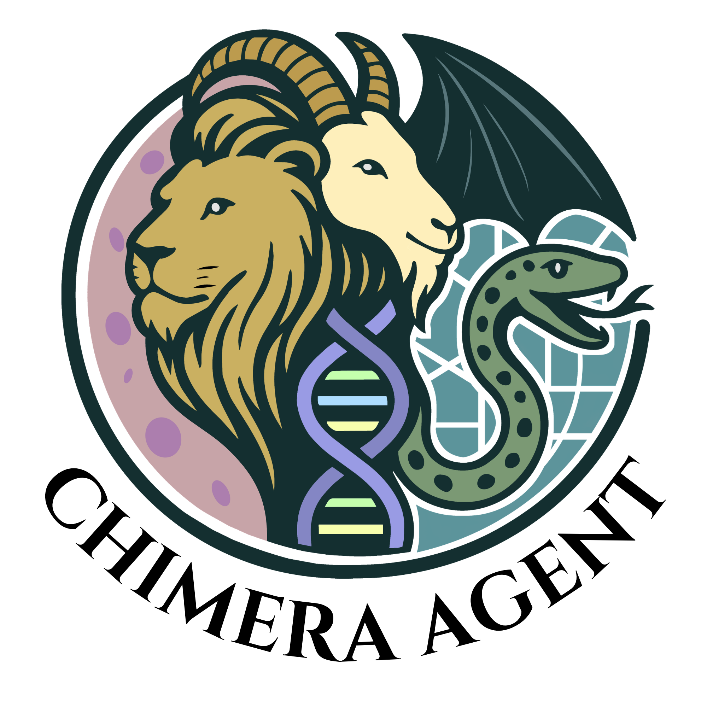
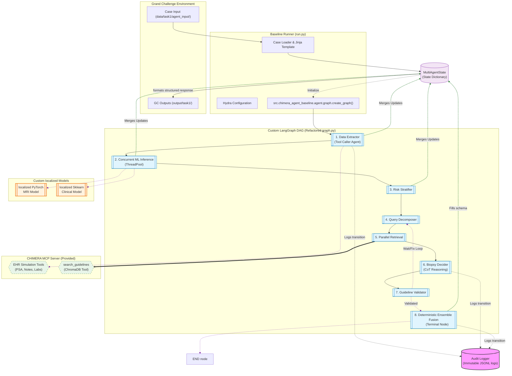

  

# Chimera Multi Agent System

My implementation of multi-agentic system for the
[CHIMERA-Agent challenge](https://chimera-agent.grand-challenge.org/chimera-agent/).
A LangGraph ReAct loop calls clinical tools served via MCP, retrieves
guidelines via RAG, and emits a structured per-case decision through a
terminal form-fill node.

My implementation is an 8-agent LangGraph pipeline that performs parallel query-decomposed RAG and concurrent deep learning/clinical ML inference. It then elevates decision reliability by cross-checking reasoning through a guideline validator and combining all risk signals into a rule-based ensemble fusion node for calibrated, auditable outputs.
# Architecture Overview

This repository implements a localized multi-agent decision support system orchestrated via LangGraph. It replaces the baseline's monolithic ReAct loop with a dedicated Directed Acyclic Graph (DAG) designed to enhance reasoning reliability through specialized agents, concurrent localized ML inference, and query-decomposed RAG.

The system integrates directly into the official CHIMERA runner framework. It interfaces with the organizing framework’s Model Context Protocol (MCP) server to simulate realistic EHR masking while executing localized, state-of-the-art machine learning models on MRI embeddings and clinical features.

## Visual System Architecture

The architecture operates on a cyclical shared state dictionary (MultiAgentState), where each specialized agent node performs a discrete action, updates the state with partial results, and triggers the next node.Framework Execution: The framework (run.py) initializes the environment, mounts the organizing team’s MCP Server, and builds the agent graph. It loads patient data via Structured-prompt.json but holds the "Extended EHR View" masked behind MCP tools.   
Node 1: Data Extractor (Active EHR Uncovering): Unlike baselines that ingest flat dictionaries, this agent is a localized ReAct loop. It actively invokes MCP Tools (e.g., retrieving masked pathology, full MRI reports, and longitudinal notes) to simulate clinical chart review. It merges this uncovered data into a predefined schema in the Shared State.   
Node 2: Concurrent ML Inference: This node executes two localized, quantitative machine learning models in parallel using a python thread pool, ensuring efficient execution without blocking the main LLM thread.   MRI Classifier: Executes a localized PyTorch deep learning model against frozen modality-level embeddings (derived from patient imaging) to determine clinically significant prostate cancer (csPCa) probability.   Clinical Readiness Model: Executes a localized Scikit-Learn classifier on extracted patient clinical features to compute a baseline biopsy readiness probability.   
Nodes 3–5: Structured Knowledge Retrieval stack: Instead of ad-hoc retrieval, this stack applies Structural Query Decomposition.Risk Stratifier (Node 3): Combines LLM reasoning with rules to perform dynamic NCCN risk categorization.   
Query Decomposer (Node 4): Breaks the complex record into 3–5 targeted clinical sub-queries (e.g., PSA velocity criteria, PI-RADS management pathways).   Parallel Retrieval (Node 5): Executes these sub-queries concurrently against the organized framework’s guidelines search tool, performing deduplication and reranking chunks before feeding verified clinical evidence into the state.   
Node 6: Biopsy Decider (CoT Reasoning): This specialized urology decision agent receives all available signals: extracted clinical data, localized ML csPCa/readiness probabilities, and RAG-grounded guidelines. It performs step-by-step Chain-of-Thought (CoT) reasoning, reconciling signals, and noting any disagreements between the LLM and the numerical ML models.   
Node 7: Guideline Validator (Safety Guard): A dedicated validator agent acts as a safety gate. It cross-checks the Biopsy Decider’s output and key factors against the retrieved guidelines. If the reasoning contradicts known guidelines (e.g., recommending against biopsy on a PI-RADS 5 lesion with high PSA density), it flags the decision as REJECTED and triggers a conditional routing loop back to the Decomposer (Node 4) for clarification.   
Node 8: Deterministic Ensemble Fusion (Terminal Node): To avoid final-pass hallucination, this node is purely rule-based (non-LLM). It mathematically combines all risk signals (LLM confidence, localized ML probabilities, and validator verification scores) to produce the final biopsy recommendation (yes/no). It formats the output precisely into the Pydantic schema required by the challenge runner.  

For details on the challenge, tasks tested and Input/Output, please see the baseline repo: https://github.com/DIAGNijmegen/chimera-agent-baseline/
